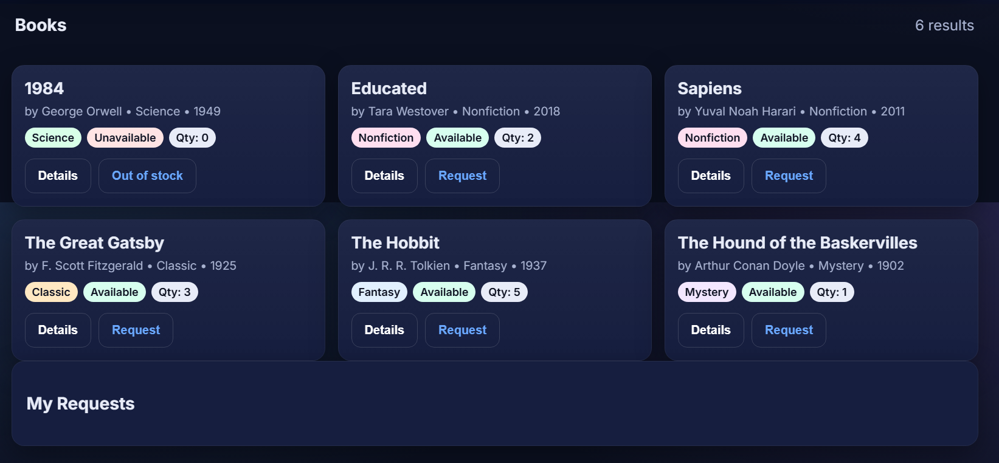

# 📚 BookMatrixPro

**BookMatrixPro** is a modern **web-based Library Management System** built with **HTML, CSS, and JavaScript**.
It helps users **manage, track, and explore books** efficiently — featuring a clean UI, interactive forms, and multiple color themes.

---

## 🚀 Features

* 🧾 **User Management**

  * Add, view, and manage user records with dynamic forms.
  * Validate and store essential user details like name, email, and membership ID.

* 📘 **Book Records Handling**

  * Manage a digital catalog of books with title, author, and genre.
  * Interactive sorting and searching for quick access.

* 🔍 **Smart Search**

  * Instantly filter books and users through a responsive search interface.

* 🎨 **Dynamic Theme System**

  * 28 color palettes (14 light, 14 dark) with persistent local storage.
  * Automatically adjusts between light and dark mode for better readability.

* 💾 **Local Storage Integration**

  * All book and user data are stored in the browser’s local storage.
  * Ensures quick load times and offline availability.

* 💬 **Interactive UI**

  * Responsive, user-friendly, and visually appealing interface.
  * Smooth animations and modular layout for a modern experience.

---

## 🧩 Tech Stack

* **HTML5** — Semantic structure for all pages
* **CSS3** — Responsive layouts and theme-based UI
* **JavaScript (Vanilla)** — Logic, interactivity, and data management
* **LocalStorage API** — Persistent storage for book and user records

---

## 🖥️ Live Demo

🔗 **Try it here:** [https://bookmatrixpro.netlify.app/user.html](https://bookmatrixpro.netlify.app/user.html)

---

## ⚙️ Setup Instructions

1. Clone the repository:

   ```bash
   git clone https://github.com/<your-username>/BookMatrixPro.git
   cd BookMatrixPro
   ```

2. Open the main page (`user.html` or `index.html`) directly in your browser.

No additional setup required — **pure HTML, CSS, and JavaScript**.

---

## 📂 Project Structure

```
BookMatrixPro/
│
├── index.html        # Homepage / Dashboard
├── user.html         # User management interface
├── books.html        # Book catalog page
├── style.css         # UI and theme design
├── script.js         # Logic and interactivity
└── favicon.svg       # App icon
```

---

## 📸 Screenshot




---

## 👨‍💻 Author

**MALLIDI SAI SURESH REDDY**
🌐 [Portfolio](https://worksbysuresh.netlify.app/)
💼 Open for collaboration & internships

---

## 🪪 License

This project is licensed under the **MIT License** — free to use, modify, and distribute.

---

> “Organize smarter, read better — manage your world of books with **BookMatrixPro**.”
